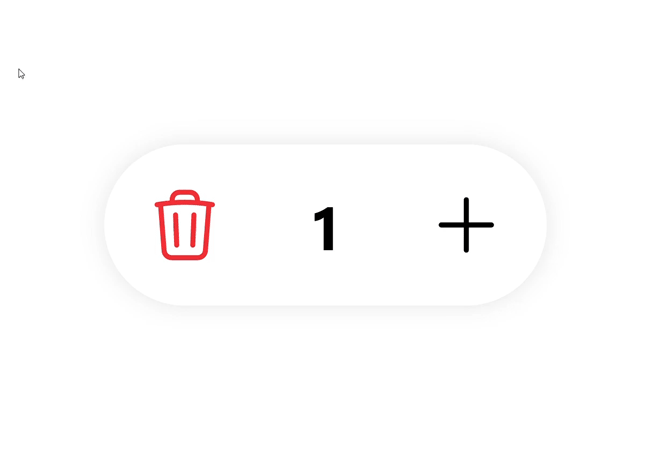

# NgxInputCounter

<p align="center">
  
</p>

[][npm-url]
[][npm-url]

[npm-url]: https://www.npmjs.com/package/ngx-input-counter

The input number with counter for Angular

## Getting Started

### Versions

| Angular  | ngx-input-counter |
| -------- |:------:| 
| >=15.0.0 | v0.0.x |

### Instalation

```
npm i ngx-input-counter
```

## Usage

Import the module

```typescript
import { NgxInputCounterModule } from 'ngx-input-counter';
@NgModule({
  ...
  imports: [
    ...,
    NgxInputCounterModule,
  ],
})
```

Use in your components

```html
<ngx-input-counter [(ngModel)]="qty"></ngx-input-counter>
```

### Props

| Name | Type | Default | Description |
|-------------|--------------------|-------------|------------------------------------------|
| value | `number` | `0` | Initial state of the toggle button |
| min | `number` | `-Infinity` | Transition time for the animation |
| max | `number` | `Infinity`  | Transition time for the animation |
| step | `number` | `1` | Transition time for the animation |
| minusTemplate | `TemplateRef` | `-` | Pass a TemplateRef to replace the minus button content |
| plusTemplate | `TemplateRef` | `+` | Pass a TemplateRef to replace the plus button content |

### Outputs

| Name   | Payload | Description |
| ---    | ------  | -------     |
| change | value   | Triggered when state of the component changes. <br>Contains: <br>`value` - state of the component |

## Development

Clone this repo and install the dependencies. Run `ng serve` for a dev server. Navigate to `http://localhost:4200/`. The application will automatically reload if you change any of the source files.

### Running unit tests

Run `ng test` to execute the unit tests via [Karma](https://karma-runner.github.io).

### Running end-to-end tests

Run `ng e2e` to execute the end-to-end tests via a platform of your choice. To use this command, you need to first add a package that implements end-to-end testing capabilities.

## Contributing

See Contributing Guide.

## License

MIT
